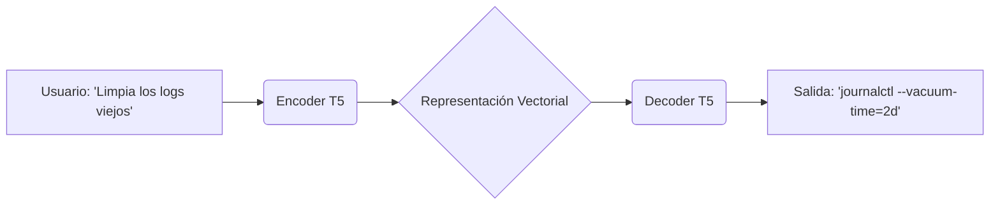

# MANGO: Documentación Técnica del Asistente Sysadmin AI (v2.0)

## 1. Actualización de Arquitectura: El Motor T5

Tras las pruebas iniciales con modelos generalistas tipo Decoder-only (como Qwen), se ha determinado que dicha arquitectura no es óptima para la tarea específica de NL2Bash (Natural Language to Bash).

Por ello, el núcleo de MANGO ha migrado a una arquitectura basada en T5 (Text-to-Text Transfer Transformer).

### ¿Qué es T5 y cómo funciona?

T5 es un modelo desarrollado por Google Research que replantea todas las tareas de procesamiento de lenguaje natural como un problema de "texto a texto".

A diferencia de los modelos tipo GPT (que intentan predecir la siguiente palabra en una conversación abierta), T5 utiliza una arquitectura Encoder-Decoder:

* **El Encoder (Comprensión):** Recibe la instrucción del usuario (ej: "búscame los archivos grandes"). Su trabajo es entender la semántica, la intención y el contexto de la frase, comprimiendo esa información en una representación matemática densa.
* **El Decoder (Generación):** Toma esa representación y "traduce" la intención a un lenguaje de salida específico, en nuestro caso, Bash Scripting (ej: find . -type f -size +100M).

### ¿Por qué hemos abandonado Qwen/Llama?

Los modelos LLM masivos (7B, 14B, etc.) como Qwen presentaron los siguientes problemas para este caso de uso específico:

* **Verbosity (Verborrea):** Tendían a explicar el comando en lugar de simplemente ejecutarlo, o añadían texto innecesario ("Aquí tienes el comando que pediste...").
* **Overhead Computacional:** Requerían demasiada VRAM para una tarea que es, esencialmente, una traducción sintáctica.
* **Inestabilidad en la Sintaxis:** Al ser modelos probabilísticos de chat, a veces alucinaban flags inexistentes o intentaban conversar en lugar de actuar.

### Ventajas de T5 para un Asistente Sysadmin

La elección de T5 (específicamente variantes optimizadas para código como CodeT5) aporta ventajas críticas:

* **Especialización en "Traducción":** Para T5, convertir Español -> Bash es idéntico a traducir Inglés -> Francés. Es su función nativa, lo que garantiza una precisión sintáctica superior.
* **Eficiencia Extrema:** Un modelo T5 de 220M o 770M de parámetros puede superar en precisión de código a modelos de chat de 7.000M de parámetros, siendo infinitamente más rápido y ligero.
* **Input/Output Determinista:** T5 es menos propenso a "alucinar" o inventar datos. Si se entrena con el dataset MANGO_DATA, aprenderá a mapear la intención (input) al comando (output) de forma casi matemática.
* **Soporte Multilingüe Robusto:** Gracias a su pre-entrenamiento masivo, entiende perfectamente los matices de la jerga ("cepíllate el proceso") y los mapea correctamente a la acción técnica (kill -9).

### Resumen del Flujo de Datos (Pipeline)

